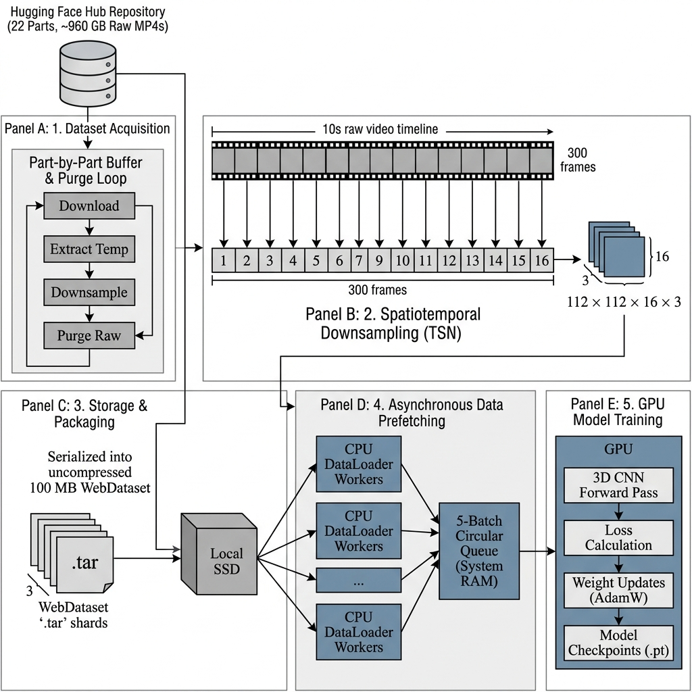

<div align="center">

# Kinetics-700 Dataset Downloader & Manager

[](https://www.python.org/downloads/)
[](https://huggingface.co/datasets/atalaydenknalbant/Kinetics-700)
[](https://huggingface.co/datasets/kaziistiyak/Kinetics-700)
[](https://opensource.org/licenses/MIT)

An interactive, multi-threaded GUI downloader and preprocessing manager designed to automate fetching, extracting, and radically compressing the Kinetics-700 dataset on the fly.


</div>

---

## 📑 Table of Contents
- [Direct Download: Preprocessed 112x112 Dataset](#direct-download)
- [The Problem & The Solution](#the-problem-the-solution)
- [Smart Compression Architecture](#smart-compression)
- [Fault Tolerance & Dual-Drive Storage](#fault-tolerance)
- [Quick Installation Guide](#quick-installation)
- [Kinetics-700 Dataset Card](#dataset-card)
- [FFmpeg Requirement](#ffmpeg-requirement)
- [Virtual Environment Integration](#virtual-environment)

---

<a id="direct-download"></a>
## 📦 Direct Download: Preprocessed 112x112 Dataset

If you do not want to run the downloader and preprocessing pipeline yourself, you can download the already downsampled Kinetics-700 archive release here:

**👉 [kaziistiyak/Kinetics-700 on Hugging Face](https://huggingface.co/datasets/kaziistiyak/Kinetics-700)**

This hosted release contains split `.zip` archives of the processed `112x112` dataset so users can download, extract, and start training without downloading the full raw Kinetics-700 archives first.

Available archive files:

| File | Purpose |
|------|---------|
| `train.zip` | Downsampled training split |
| `validation.zip` | Downsampled validation split |
| `test.zip` | Downsampled test split |
| `raw.zip` | Source metadata files used by the downloader |

Example extraction:

```bash
unzip train.zip
unzip validation.zip
unzip test.zip
unzip raw.zip
```

The rest of this repository is for users who want to reproduce the download, extraction, and TSN-style downsampling pipeline themselves.

---

<a id="the-problem-the-solution"></a>
## 🚀 The Problem & The Solution

**The Problem:** Traditionally, computer vision researchers working with **Kinetics-700** must download 22 massive `.zip` and `.tar.gz` archives. This requires nearly a **terabyte of free space** and extensive, painful manual extraction before training can even begin.

**The Solution:** This application completely automates that pipeline. It reduces a massive **960GB dataset footprint down to an optimized 20GB**, making it possible to prepare and train on a standard, low-capacity PC.

---

<a id="smart-compression"></a>
## 🧠 Smart Compression Architecture (TSN)

The primary goal of this manager is to demonstrate that large-scale video data can be downloaded and prepared dynamically.

Instead of saving enormous, high-framerate, 1080p video clips to your hard drive, the manager utilizes a **Temporal Segment Networks (TSN) Compression Architecture**:

1. **Spatial Downscaling:** Videos are aggressively downscaled to `112x112` or `114x114` resolutions. These dimensions perfectly balance spatial clarity with minuscule file sizes and are **ideal for 3D Neural Network training**.
2. **Temporal Frame Sampling:** The software slices each video into segments and extracts a uniform sequence (e.g., 16 frames), completely discarding redundant temporal data.
3. **On-the-Fly Processing:** Extraction, parsing, downsampling, and saving happen iteratively in a buffer pipeline. The original 40GB+ zip archives are purged immediately after their contents are downsampled—meaning you never need 960GB of free space at any given moment.

<div align="center">



</div>

---

<a id="fault-tolerance"></a>
## 🛡️ Fault Tolerance & Dual-Drive Storage

To manage massive workloads safely, the downloader employs a sophisticated dual-drive storage architecture and robust state persistence.

* **Staging HDD Buffer (`E:/TEMP`):** Massive compressed `.tar.gz` and `.zip` chunks (often exceeding 40GB each) are temporarily downloaded and extracted to a dedicated staging drive. This buffer strategy protects your main fast storage from extreme read/write wear and prevents "disk full" crashes.
* **Final Output SSD (`H:/.../112x112`):** Only the perfectly processed, downscaled, and temporally sliced lightweight videos are moved to your high-speed SSD, ensuring your deep learning models have instant, bottleneck-free access to the data during training.

### 🔄 Intelligent Pause & Resume Resilience
Network drops, system crashes, or scheduled PC restarts will **never** corrupt your dataset. The manager continuously checkpoints its state. If a download or extraction is interrupted, you can restart the application at any time. It will instantly verify the integrity of the existing data, bypass completed chunks, and resume exactly where it left off.

---

<a id="quick-installation"></a>
## ⚡ Quick Installation Guide

This project includes a **One-Click Setup Manager** that handles everything—including the Python virtual environment integration and dependency installation.

### 🪟 Windows Setup
1. Ensure [Python 3.8+](https://www.python.org/downloads/) and [FFmpeg](#ffmpeg-requirement) are installed.
2. Double-click the `run_manager.bat` file.
3. The script will automatically create a `.venv` virtual environment, install the required packages from `requirements.txt`, and launch the interactive GUI.

### 🐧 Linux Setup
1. Ensure `python3`, `python3-venv`, and `ffmpeg` are installed.
2. Make the script executable: 
   ```bash
   chmod +x run_manager.sh
   ```
3. Run the manager:
   ```bash
   ./run_manager.sh
   ```
4. Like on Windows, it will safely isolate the dependencies in a `.venv` folder and start the GUI.

---

<a id="dataset-card"></a>
## 📊 Kinetics-700 Dataset Card

We officially use the [Atalay Denknalbant Kinetics-700](https://huggingface.co/datasets/atalaydenknalbant/Kinetics-700) dataset hosted on Hugging Face as our verified source.

> **📦 🚨 IMPORTANT Dataset Decompression Notice:**
> To fully utilize the Kinetics-700 dataset, you must download and decompress all 22 zipped archives. Failure to do so will result in an incomplete dataset. **Note: This Downloader automates this entire process.**

### 📝 Dataset Description
The Kinetics-700 dataset is a large-scale collection of YouTube video URLs for human action recognition. It significantly increases the number of action classes and video clips from the original Kinetics dataset, providing a robust benchmark for evaluating models on complex and diverse human actions. 

Each video clip is approximately **10 seconds long** and depicts a single human action out of **700 classes**, drawn from a wide distribution of settings, subjects, and camera angles.

### 🏗️ Dataset Structure
The dataset is typically structured with distinct splits for training, validation, and testing. Each entry generally includes:
* **🎞️ Video Clip:** A short segment of video (e.g., MP4 format).
* **🏷️ Label:** The corresponding action class (e.g., "playing violin," "riding a bicycle").
* **📜 Metadata:** Information such as the original YouTube video ID and start/end timestamps.

### 📈 Dataset Statistics

| Metric | Value |
|--------|-------|
| **🔢 Classes** | 700 unique human action classes |
| **💾 Total Size** | 871 GB (Raw) |
| **🎬 Total Clips** | 635,000 video clips |
| **🏋️ Training Set** | 536,499 clips (~757 GB) |
| **✅ Validation Set** | 33,966 clips (~35 GB) |
| **🧪 Test Set** | 64,535 clips (~79 GB; labels withheld) |
| **⏱️ Clip Duration** | ~10 seconds per clip |

### ✍️ Data Collection and Annotation
Clips are extracted from YouTube videos. Human annotators identify specific segments corresponding to a predefined list of action categories. For each action class, multiple video examples are collected to capture variability. Annotations specify precise start and end times.

### 💡 Use Cases
* **🏃‍♀️ Action Recognition:** Training and evaluating deep learning models to classify human actions in video.
* **🧠 Video Understanding:** Advancing research in understanding dynamic content in video.
* **🔄 Transfer Learning:** Pre-training large-scale video models that can then be fine-tuned for other tasks.
* **🏆 Benchmarking:** A standard benchmark for comparing video analysis algorithms.

### 🚧 Limitations and Biases
* **🌐 YouTube Source Bias:** May reflect biases in user-generated content (e.g., dominant cultural activities).
* **🗺️ Geographical/Demographic Skew:** Might not perfectly represent global diversity, skewing towards YouTube demographics.
* **❓ Action Ambiguity:** Some actions have subtle variations or overlap, leading to potential labeling ambiguities.
* **⚖️ Copyright & Licensing:** Requires adherence to YouTube's terms of service and applicable copyright laws.
* **🔬 Research Use Only:** Provided for academic research and non-commercial use. Users must acknowledge the original source.

---

<a id="ffmpeg-requirement"></a>
## ⚙️ FFmpeg Requirement

This downloader heavily relies on **FFmpeg** as the backend rendering engine to process and downsample spatiotemporal video frames accurately at high speed. 

> **⚠️ You MUST install FFmpeg for this manager to work.**

### Installation Links:
* **Windows:** [Download FFmpeg for Windows](https://gyan.dev/ffmpeg/builds/) or install via winget: `winget install ffmpeg`
* **Linux (Ubuntu/Debian):** `sudo apt install ffmpeg`
* **macOS:** `brew install ffmpeg`

*Once installed, ensure that `ffmpeg` is added to your system's `PATH` environment variable so the Python scripts can execute it globally.*

---

<a id="virtual-environment"></a>
## 💻 Virtual Environment Integration

To prevent conflicts with your system's global Python packages, this downloader forces strict virtual environment (`.venv`) integration. 
* You do not need to manage this manually. The `run_manager.bat` and `run_manager.sh` scripts encapsulate the setup.
* If the environment gets corrupted, simply delete the `.venv` folder and run the manager script again for a fresh, clean installation.
